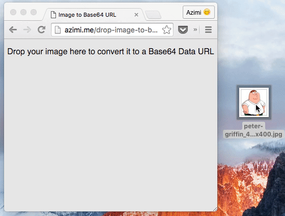

# Drop Image to Base64 Data URL
Convert images to Base64 by just dropping them inside this web app.

### [Open The App](http://azimi.me/drop-image-to-base64/)

## How it's built?
This is a serverless web application where it uses following web APIs to
convert an image to Base64 data URL and allow you to download or copy
the result.

* Drag and Drop API
* File Reader API
* Download Link API (`a[download]`)
* Clipboard API

## License
MIT